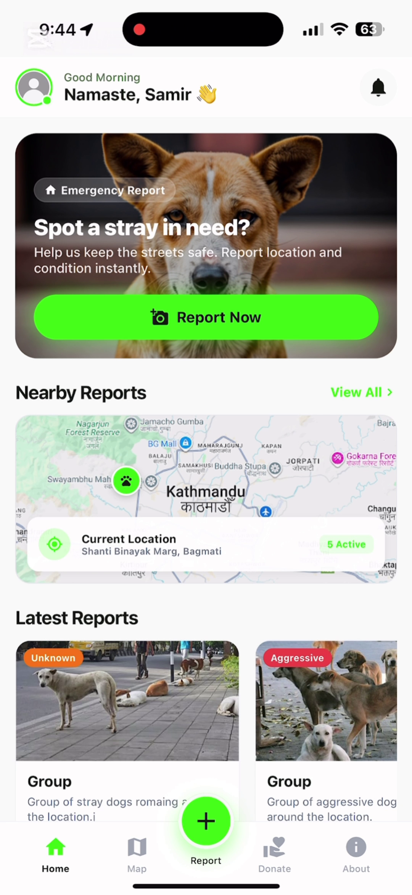
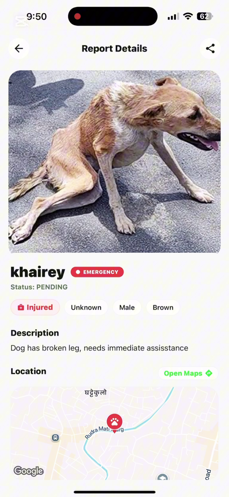
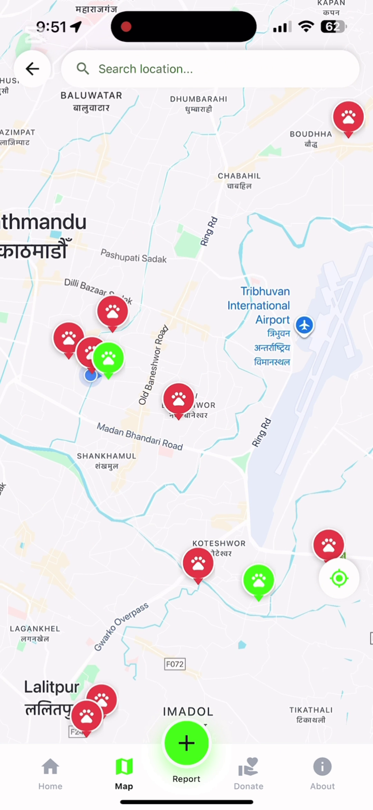
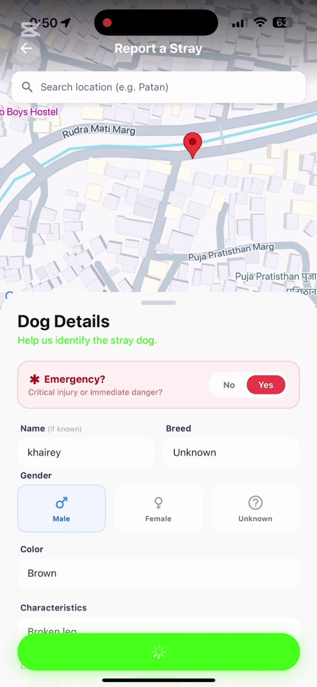
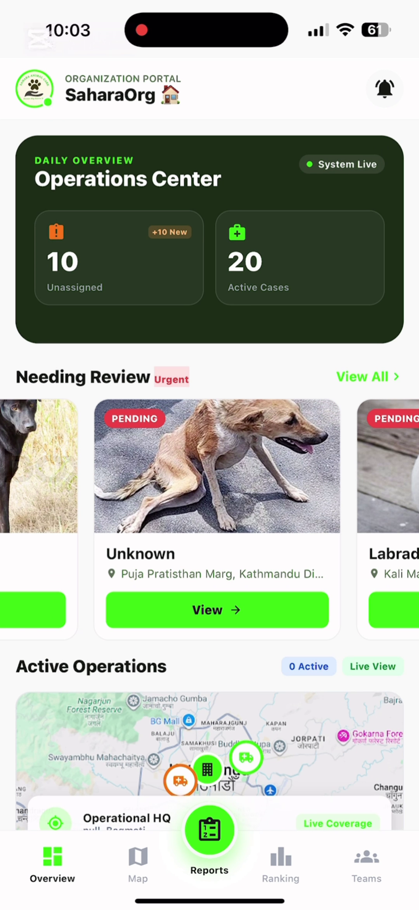
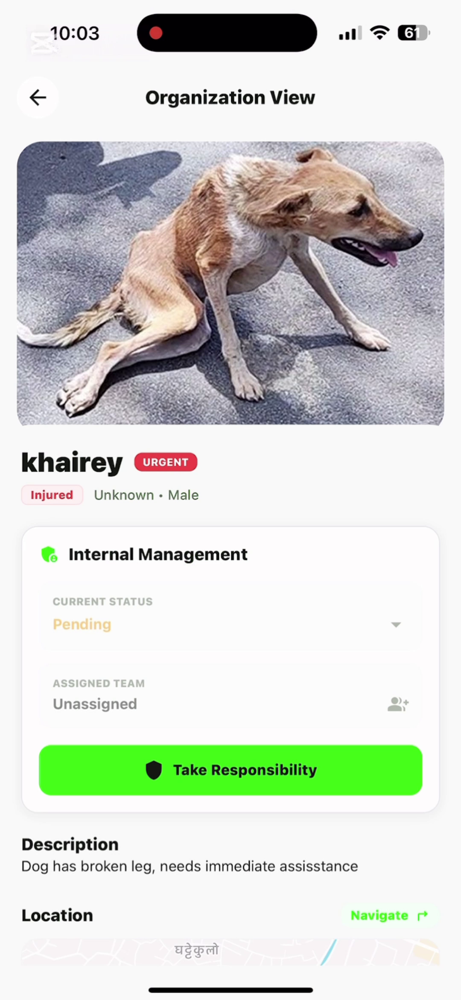
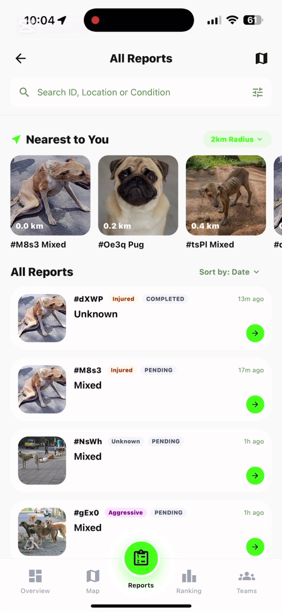
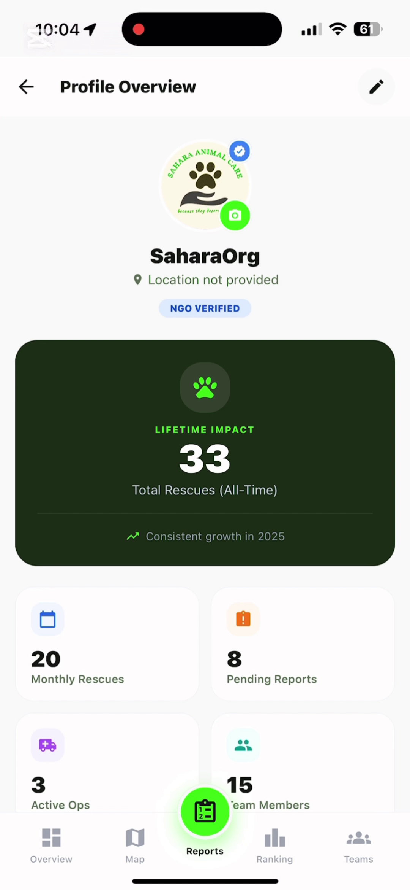

# StrayMandu 🐕🇳🇵

> **Report, Rescue, React.** A community-driven platform to help stray dogs in Kathmandu.

StrayMandu connects compassionate citizens with animal rescue organizations. Users can easily report stray dogs in need of help, while registered organizations can view these reports, coordinate rescues, and update the community on their efforts.

## 🌟 Features

### For Users (Reporters)
-   **Report Stray Dogs**: Capture photos and details (breed, condition, location) of stray dogs.
-   **Interactive Map**: View reported dogs in your area.
-   **Track Reports**: See the status of your reports (Pending, Rescued, etc.).
-   **Community**: Access leaderboards and donation options to support the cause.

### For Organizations (Rescuers)
-   **Dashboard**: Overview of pending cases and rescue statistics.
-   **Real-time Alerts**: Receive notifications for urgent reports nearby.
-   **Rescue Management**: Update the status of reports and manage rescue teams.
-   **Profile**: Showcase your organization's impact and details.

## 📱 App Screenshots

<p align="center">
  
  
  

</p>

<p align="center">
  
  
  
</p>

<p align="center">
  
  
  
</p>

<p align="center">
  
  
</p>

## 🛠️ Tech Stack

-   **Framework**: [React Native](https://reactnative.dev/) with [Expo](https://expo.dev/) (SDK 52)
-   **Language**: [TypeScript](https://www.typescriptlang.org/)
-   **Routing**: [Expo Router](https://docs.expo.dev/router/introduction/)
-   **Backend & Auth**: [Firebase](https://firebase.google.com/) (Firestore, Auth)
-   **Maps**: [react-native-maps](https://github.com/react-native-maps/react-native-maps)
-   **Media**: Cloudinary

## 🚀 Getting Started

### Prerequisites
-   Node.js (LTS recommended)
-   npm or yarn

### Installation

1.  **Clone the repository**
    ```bash
    git clone https://github.com/asim-p/StrayMandu.git
    cd StrayMandu
    ```

2.  **Install dependencies**
    ```bash
    npm install
    ```

3.  **Start the application**
    ```bash
    npx expo start
    ```

4.  **Run on Device/Emulator**
    -   Scan the QR code with the **Expo Go** app (Android/iOS).
    -   Press `a` to open in Android Emulator.
    -   Press `i` to open in iOS Simulator.

## 📂 Project Structure

The project has been restructured to a clean root-level layout:

```
StrayMandu/
├── app/                 # Expo Router screens (pages)
│   ├── Org*.tsx        # Organization-specific screens
│   ├── (tabs)/         # Main navigation tabs (if applicable)
│   ├── index.tsx       # Entry point
│   └── ...
├── src/
│   ├── components/     # Reusable UI components
│   ├── config/         # Firebase config
│   ├── context/        # React Context (Auth, etc.)
│   ├── hooks/          # Custom Hooks
│   ├── services/       # API services (Report, Notification)
│   └── utils/          # Helper functions
├── assets/             # Images and fonts
└── package.json        # Dependencies and scripts
```

## 🤝 Contributing

We welcome contributions! Please fork the repository and submit a pull request.

1.  Fork the Project
2.  Create your Feature Branch (`git checkout -b feature/AmazingFeature`)
3.  Commit your Changes (`git commit -m 'Add some AmazingFeature'`)
4.  Push to the Branch (`git push origin feature/AmazingFeature`)
5.  Open a Pull Request

## 📄 License

This project is licensed under the MIT License.
